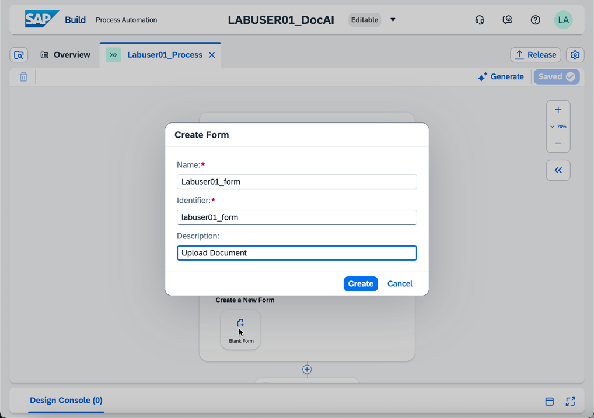

Gabe Mensching, Vass, <gabe.mensching@vasscompany.com>

Michael Pytel, Vass, <michael.pytel@vasscompany.com>

<https://vasscompany.com>

# Environment Information

- Please use GOOGLE CHROME as your browser

- SAP BTP URLs:

  - [Global Account Direct
    Link](https://amer.cockpit.btp.cloud.sap/cockpit#/globalaccount/2c774650-2712-4b97-93a8-bc558d875b64/accountModel)

  - [SAP Build Sub Account
    Link](https://amer.cockpit.btp.cloud.sap/cockpit#/globalaccount/2c774650-2712-4b97-93a8-bc558d875b64/subaccount/bf0d91cd-3031-4a2e-8358-bca1b2394970/subaccountoverview)

  - [SAP Document AI Sub Account
    Link](https://amer.cockpit.btp.cloud.sap/cockpit#/globalaccount/2c774650-2712-4b97-93a8-bc558d875b64/subaccount/4fd2abe1-6f99-4865-ad26-7fccc0a36377/subaccountoverview)

- SAP Build App URLs

  - [SAP Build Apps](https://vass-sap-build-ai2.us10.build.cloud.sap/)

  - [SAP Document AI
    Link](https://sap-document-ai-gcp.us30.doc.cloud.sap/)

- Replace \<##\> with your Lab User Number assigned by the instructors

{width="2.203546587926509in"
height="3.1808530183727033in"}{width="2.2888560804899387in"
height="3.169922353455818in"}

- 

# Configure SAP Document AI

1.  Open an Incognito Browser and navigate to the SAP BTP Cockpit

    a.  <https://amer.cockpit.btp.cloud.sap/cockpit>

2.  Navigate to the 'SAP Document AI' Subaccount

3.  Navigate to *Instances and Subscriptions \> SAP Document AI*

4.  Click on the hyperlink to access the application

> {width="4.564231189851268in"
> height="2.3155194663167102in"}

5.  If prompted, enter your Lab UserID and Password

6.  Next, we're going to create a new custom schema to configure that
    data elements we want Document AI to extract from the documents we
    upload

7.  Click on Schema Configuration from the left navigation

8.  Then select Create

{width="5.505622265966754in"
height="2.6416469816272965in"}

9.  On the New Schema prompt enter the following data

    a.  Name: labuser##\_gm

    b.  Description: Labuser## Goods Movement

    c.  Document Type: Custom

    d.  OCR Engine Type: Document

10. Click Create

{width="5.236111111111111in"
height="1.8472222222222223in"}

11. Next, click Add within the Header Fields section. Enter the data
    below

    a.  Name: Source_Bin

    b.  Label: Source Bin

    c.  Description: Source Bin

    d.  Data Type: String

    e.  Setup Type: Auto

12. Click Save. And repeat for the following fields

  ---------------------------------------------------------------------------------------
  [Name:]{.mark}   [Label:]{.mark}   [Description]{.mark}   [Data          [Setup
                                                            Type]{.mark}   Type]{.mark}
  ---------------- ----------------- ---------------------- -------------- --------------
  Target_Bin       Target Bin        Target Bin             String         Auto

  Product          Product           Product                String         Auto

  Quantity         Qty               Quantity               String         Auto

  Notes            Notes             Notes                  String         Auto

  UoM              UoM               UoM                    String         Auto
  ---------------------------------------------------------------------------------------

13. After you have entered all fields, click Activate.

> {width="5.095503062117236in"
> height="3.0203805774278214in"}

14. Next, we're going to upload a document to process as a test
    scenario.

15. Click on Documents in the Left Navigation.

16. The click the + symbol to Upload a Document.

{width="5.401648075240595in"
height="3.0790463692038497in"}

17. Select the following values from the Drop Down Displayed

    a.  Document Type: Custom

    b.  Schema: labuser##\_gm

        i.  Replace \## with your labuser number from above

    c.  Schema Version: 1 (default)

    d.  Template: Detect Automatically

18. Click the + symbol again to select a document stored locally

    a.  The instructors will provide files to you before the lab

19. Once you've selected a document, click the Confirm Button

{width="5.4940726159230096in"
height="3.265758967629046in"}

20. The *Status* will be displayed as PENDING initially. Wait 30-60
    seconds and the status should update to DONE

21. Select your Document Line to view the results.

22. Select the Edit button to confirm or updated any results

{width="5.465671478565179in"
height="3.2397987751531057in"}

23. Congratulations! You've successfully defined a document schema for
    SAP Document AI to process! Documents upload via the Document AI API
    can be processed asynchronously and the resulting extracted output
    can be used in other processes.

# Create an Automation with SAP Build 

1.  Logon to SAP Build by directly clicking the link below

    a.  [SAP Build
        Apps](https://vass-sap-build-ai2.us10.build.cloud.sap/)

    b.  or by navigating to <https://amer.cockpit.btp.cloud.sap/> \> Sub
        Account \> SAP Build TDD \> Instances & Subscriptions \>
        Subscriptions \> SAP Build Apps

2.  If prompted, login with the Lab UserID information provided earlier

3.  From the Lobby, click Create \> Create

> {width="4.13403980752406in"
> height="2.450469160104987in"}

4.  Select *Automation Process*

{width="5.210635389326335in"
height="2.5379735345581804in"}

5.  Select *Process*

{width="5.195534776902887in"
height="2.7711668853893263in"}

6.  Enter the data below

    a.  Name: Labuser##\_DocAI

    b.  Description: Labuser## Document AI

{width="4.11266404199475in"
height="3.188583770778653in"}

7.  Click Review

8.  Click Create

9.  A new browser tab will open

10. Click 'Accept' if shown a disclaimer

11. Enter the following on the prompt to *Create Process*

    a.  Name: Labuser##\_Process

    b.  Identifier: Labuser##\_Process

    c.  Description: Labuser## Process Documents

> {width="3.1527777777777777in"
> height="2.0277777777777777in"}

12. Before we add automations and processes we need to configure some
    additional settings.

13. Click the Settings {width="0.25in"
    height="0.18055555555555555in"} icon in the upper right

14. Navigate to *Environment Variables* and Click *Create*

15. Add the following Variables

  --------------------------------------------------
  Identifier   Description             Type
  ------------ ----------------------- -------------
  DocMgmt      Document Management     Destination
               Service                 

  DOX          SAP Document AI         Destination

  S4System     S4HANA System           Destination
  --------------------------------------------------

16. The variables should look like the below image when done.

> {width="4.582273622047244in"
> height="3.2275142169728785in"}

17. Next, navigate to *Dependencies* in Project Properties

18. Click Add \> Add a Business Process Project Dependancy

> {width="4.594687226596675in"
> height="3.2190955818022746in"}

19. Add a dependency for the following packages

    a.  (package) DocAILab

    b.  (package) Document AI service -- Editable

20. Next, select Add an Actions Project Dependency and select the
    following

    a.  Creates a material document / Project: S4 Material Documents -
        Read, Create

21. Your Project Settings Dependencies should look like the following
    screenshot.

{width="4.52588145231846in"
height="3.1831047681539806in"}

22. After adding your Environment Variables and Dependencies click
    *Close*

23. Select the button 'Add a Trigger'

> {width="4.706820866141732in"
> height="3.310495406824147in"}

24. Select *Submit a Form*, on the next screen

25. Select *Create a New Form, Blank Form*

> {width="4.417310804899388in"
> height="3.106745406824147in"}

26. Enter a Name for the form in the format below

    a.  Name: Labuser##\_form

> {width="4.424341644794401in"
> height="3.11169072615923in"}

27. Click Create

28. Click the dots
    {width="0.16666666666666666in"
    height="0.125in"} next to the form and select Open Editor

> {width="3.1944444444444446in"
> height="1.1944444444444444in"}

29. Drag the 'Upload File' button to the Form Canvas

> {width="4.670544619422572in"
> height="3.2848468941382327in"}

30. Enter a Field Header Text; for example 'Upload Your File'

31. Maximum Number of Files is '1'

32. Required is Checked

> {width="4.676517935258093in"
> height="3.2890496500437445in"}

33. Next, we're going to add a field to input a *SchemaID.* This is not
    something we would ask an enter user to select. We've added to the
    demo to show how we can add input fields to a form.

34. Select the *Text* icon and drag to the canvas. Enter *SchemaID* as
    the field header, check the box for Required.

> {width="4.7124825021872265in"
> height="3.314342738407699in"}

35. Click Save and then close the form tab within the SAP Build UI by
    clicking the blue {width="0.125in"
    height="0.1111111111111111in"}

36. You're now viewing your Process. Click the
    {width="0.16666666666666666in"
    height="0.1388888888888889in"} icon below your Form

37. Select *Automation* then *Blank Automation*

> {width="2.625in"
> height="2.6944444444444446in"}
>
> {width="2.6273261154855643in"
> height="2.813096019247594in"}

38. **IMPORTNANT**: Select *SKIP* when prompted to Detect Agent Version

> {width="3.361111111111111in"
> height="2.0555555555555554in"}

39. When prompted, select Agent Version 3.40 and check the boxes for
    Windows and Mac

> {width="4.450378390201225in"
> height="3.1300021872265966in"}

40. Enter the following value when prompted for Create Automation

    a.  Name: Labuser##\_Automation

> {width="3.138888888888889in"
> height="2.5in"}

41. Click Create

42. Select the dots next to your newly created Automation and select
    Open Editor

> {width="3.0833333333333335in"
> height="1.7083333333333333in"}

43. Before clicking on anything, select *Variables* under Automation
    Details on the right.

44. Add an Input Variable

    a.  Name: folderID

    b.  Type: String

45. Add an Output Variable

    a.  Name: filePath

    b.  Type: String

> {width="4.458650481189851in"
> height="3.1358202099737533in"}

46. Click Save

47. Select Tools under Automation Details then expand Automations

48. Type 'GetFolder' in the Search box

49. Drag and drop the automation 'GetFolderContentv2' to the canvas
    after Start

> {width="4.446619641294838in"
> height="3.1273589238845143in"}

50. There will be a red X on the automation you just added.

51. Click on the Automation

52. Click the Pencil next to the Input Parameter *folderID*

> {width="4.377373140857393in"
> height="3.0786570428696414in"}

53. Expand Variables and select folderID. The expression editor will
    read Step0.folderID

> {width="4.420649606299213in"
> height="3.109094488188976in"}

54. Click Save Expression

55. Next, click any blank grey part of the canvas to remove the focus on
    the automation you just added.

56. Under Tools, Search 'Download' and select the Automation
    'DownloadDocsv2'. Drag the automation to the canvas just after the
    previous automation.

> {width="4.418873578302712in"
> height="3.1078444881889764in"}

57. Your newly added automation will had a red X. Select the Automation

58. Under input parameters, click field that says DMS Object. Select the
    variable Folder Content

> {width="4.14212489063867in"
> height="2.913205380577428in"}
>
> {width="4.134142607174104in"
> height="2.902011154855643in"}

59. Once you select the correct variable the red x will disappear. See
    below.

> {width="4.178689851268591in"
> height="2.9389206036745406in"}

60. Next, select the 'End' red circle. The Output Parameter is empty.
    Click the pencil next to the parameter.

> {width="4.215204505686789in"
> height="2.964721128608924in"}

61. Select the variable downloadedFilePath and click Save Expression

> {width="4.4918602362204725in"
> height="3.15917760279965in"}

62. Click Save in the upper right to save the Automation

63. Next, click the expand button
    {width="0.20833333333333334in"
    height="0.1527777777777778in"} in the lower right to view the Design
    Console

64. No errors should be displayed

> {width="4.325885826771653in"
> height="3.042445319335083in"}

65. Close the automation by clicking the X on the tab within the
    developer UI

66. Minimize the Design Console by clicking the
    {width="0.20833333333333334in"
    height="0.1527777777777778in"} button in the lower right

67. When we return to our process, we can see the Automation needs an
    Input Parameter defined.

> {width="4.24380905511811in"
> height="2.9847200349956253in"}

68. Click on the field and select the Form Field you created in the Form
    above.

> {width="4.264247594050744in"
> height="2.196975065616798in"}

69. Click Save and the error is removed.

> {width="4.257938538932634in"
> height="2.1937248468941384in"}

70. Click the *Add Step*
    {width="0.1388888888888889in"
    height="0.125in"} button under the automation we just added.

71. This time we're going to select Automation \> Show More

72. Scroll Down until you see *DocAI - Extract with Schema*

> {width="2.8194444444444446in"
> height="2.6805555555555554in"}

73. When you add the Automation it will have a red warning symbol. We
    need to update the Automation Input Parameters

74. Select the field 'filePath' for 'filetoUpload' and your SchemaID
    variable for SchemaName

> {width="4.308986220472441in"
> height="2.220025153105862in"}

75. Click Save and the no errors or warnings are displayed

> {width="4.3238013998250215in"
> height="3.0409798775153107in"}

76. Next, we're going to add an automation to extract the variables from
    the SAP Document AI JSON response.

77. Click the *Add Step*
    {width="0.1388888888888889in"
    height="0.125in"} button under the 'DocAI -- Extract with Schema'
    automation.

78. Select Automation and then select 'Assign Variable' from the
    DocAILab Package.

> {width="3.3055555555555554in"
> height="3.0416666666666665in"}

79. Again, we can see the red warning and we need to resolve the Inputs.

> {width="4.135301837270341in"
> height="2.130541338582677in"}

80. Select 'extractedData' as the value for extractedResponse

> {width="4.221033464566929in"
> height="2.174711286089239in"}

81. Click Save

82. And as a last step, we're going to add the API call to SAP S/4HANA.

83. Click the *Add Step*
    {width="0.1388888888888889in"
    height="0.125in"} button again, and this time select Action

> {width="2.75in"
> height="2.888888888888889in"}

84. Select the Action *Creates a material document* from the Package
    Project: S4 Material Documents - Read, Create 1.0.0

> {width="2.7916666666666665in"
> height="2.5694444444444446in"}

85. Click on the Action and set the Destination to S4System

> {width="4.350429790026246in"
> height="2.1582786526684163in"}

86. Click Save and then select the Input Tabs

87. We're going to hard code some variables in the spirit of completing
    the lab quickly. In a production scenario we would create and manage
    variables for Plant, Movement Code, Posting Date, and more.

88. Please update the following Inputs on the Action 'Creates a Material
    Document'

    a.  Select "Single Properties" for to_MaterialDocumentItem

89. Values & Variables for Action

    a.  GoodsMovementCode: 04

    b.  PostingDate: YYYY-MM-DDT00:00:00

        i.  For example: 2025-10-19T00:00:00

    c.  Expand \>Results

    d.  Material: variable out_Product

    e.  Movement Type: 311

    f.  Plant: 1710

    g.  Quantity in Entry Unit: variable out_Qty

    h.  Rec/Iss Plant: 1710

    i.  Storage Location #1: variable out_SourceBin

    j.  Storage Location #2: variable out_TargetBin

90. Example below

> {width="3.3333333333333335in"
> height="1.4444444444444444in"}

91. Click Save and close the Process in the developer UI

92. Next, we're going to click the Release Button

> {width="4.646207349081365in"
> height="2.2755949256342958in"}

93. Accept the defaults on the 'Release Project' modal and click Release

> {width="4.497759186351706in"
> height="2.20288823272091in"}

94. After releasing the project we will click the upper middle of the
    screen to select the newly released version of our project.

95. Next we will click the Deploy button

> {width="4.653839676290464in"
> height="2.187541557305337in"}

96. Once the deployment finishes we can test our form!

97. Select your deployed version, then select the process and lastly the
    form

98. Click the button for "Link to Form" to open the Form in a new tab

99. Upload your Labuser Goods Movement Form to process!

# Monitoring and Logging in SAP Build

1.  From the SAP Build Lobby
    (<https://vass-sap-build-ai2.us10.build.cloud.sap/lobby>)

2.  Click on Monitoring

{width="1.8472222222222223in"
height="2.8472222222222223in"}

3.  Click the button for Automation Jobs, set your date filters to
    explore job logs.

{width="5.099599737532809in"
height="2.378542213473316in"}

{width="5.118138670166229in"
height="2.563053368328959in"}

4.  In each log you can see the processing output and input variables
    between automations.

Thank you for completing our Hands-On Lab! Please email if you have any
questions!
